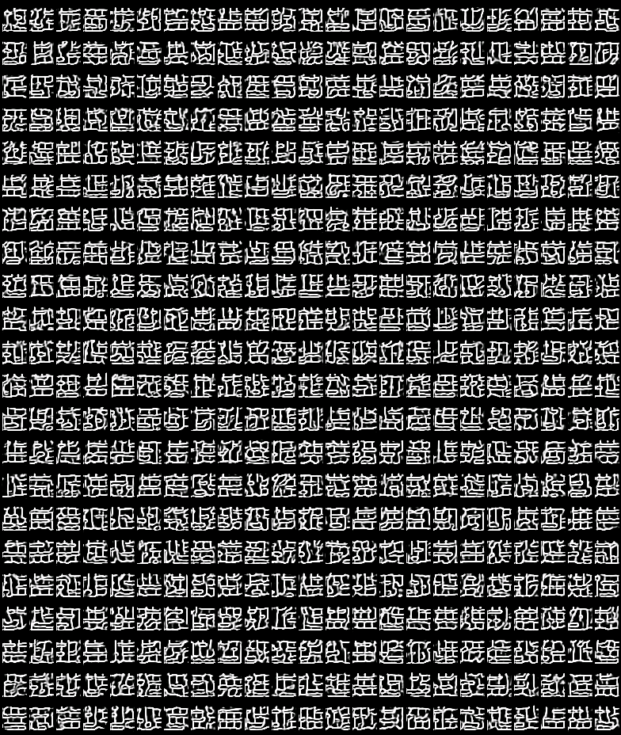

# HanZiGan
Generate 汉字 via generative adversarial network.



I thought the generated images would be the combinations of all the possible Chinese character component.....

我原以为生成的图片会是所有规范的偏旁组合成的文字，呵呵！！！


## Installation

1. install [PyTorch](https://pytorch.org/)
2. run the following command:

```shell
pip3 install -r requirements.txt
```

## Usage

```shell
python3 --log_dir [your_log_dir] --log_name [your_log_name] --font [your_font_file] --size 32 --num_workers 4 --batch_size 32 --gpu_ids 0 --num_fakes 32 --show_freq 5 --epochs 100 --d_lr 3e-4 --g_lr 0.01 --patience 10
```

